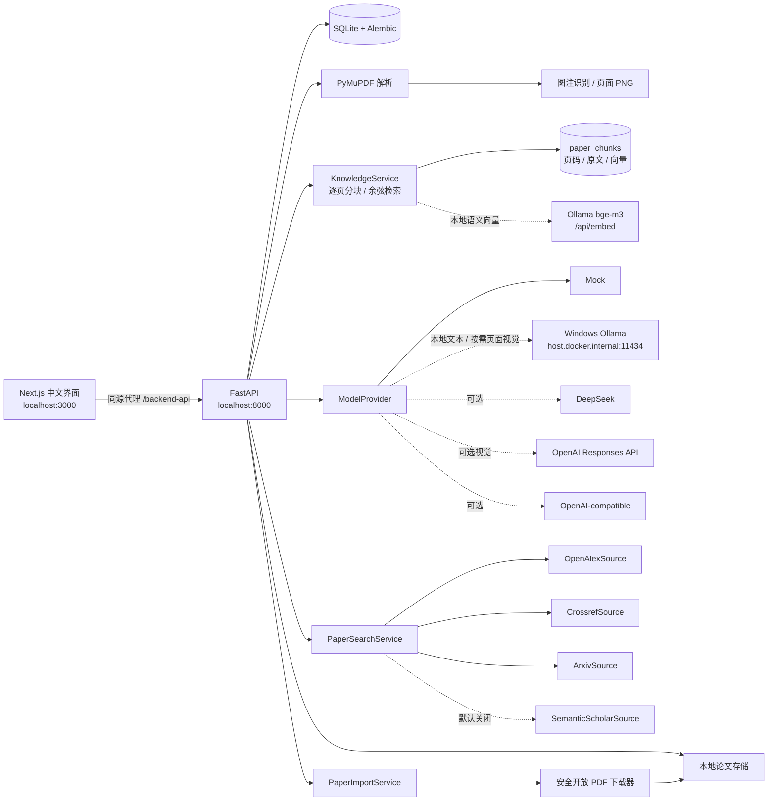
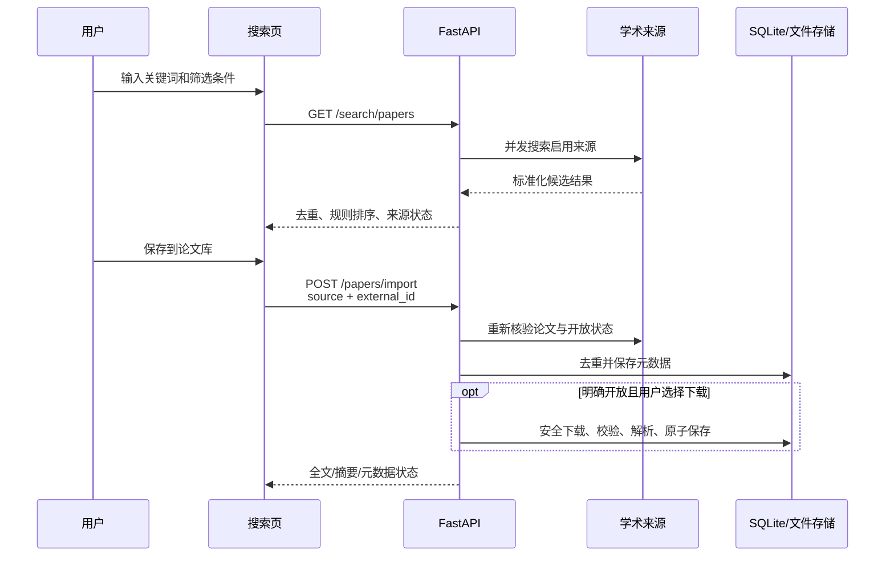

# 系统架构

## 运行结构

这是一个本地优先的前后端 Web 应用，不依赖 Codex 运行。Phase 2 继续保持单体后端和 SQLite，没有为了搜索功能增加微服务。

## 关键边界

### 模型

论文业务只依赖 `ModelProvider`。供应商 SDK 或 HTTP 细节不进入论文服务。接口显式声明 `supports_vision`，并把文本模型 `model_name` 与视觉模型 `vision_model` 分开。Mock 是默认实现；Ollama 通过原生 `/api/tags` 和 `/api/chat` 提供无密钥本地文本与按需页面视觉分析；DeepSeek 和通用兼容适配器当前仅提供文本分析；OpenAI 视觉适配器只在用户主动选择页面后调用 Responses API。真实密钥按供应商隔离，由后端环境变量或后端本地加密存储读取，永不返回给浏览器。

### PDF 与图表

PyMuPDF 提取逐页文字、页数和解析质量，并识别标准 Figure/Fig./Table 图注。`paper_visuals` 保存图表标签、页码、图注、可选分析和实际视觉模型名；页面 PNG 在后端按请求渲染并限制尺寸。浏览器可直接读取本地 PDF 和页面预览，但不会获得本地文件系统路径。图像模型调用只发送当前选中页面、论文标题、对应图注和截断后的当前页文字。

### 个人论文库检索

`EmbeddingProvider` 与回答用的 `ModelProvider` 相互独立。Phase 3A 默认由 Windows Ollama 的 `bge-m3` 通过 `/api/embed` 批量生成本地向量；测试使用确定性的 Mock 嵌入，不访问外部服务。`paper_chunks` 保存论文、页码、章节、来源等级、解析置信度、原文、内容哈希、嵌入模型和向量。

问答先按余弦相似度选取有限原文块，再交给当前文本模型。模型只引用 `[证据N]`；最终论文标题、页码、来源等级和原文片段全部由后端按检索结果装配，越界编号会被过滤。全文引用显示 PDF 页码，摘要引用明确标为摘要且不伪造页码。

Phase 3B 增加 `paper_claims` 与 `claim_evidence`。AI 分析中的结论只能映射到同一篇
论文的 `paper_chunks`；重新分析或重新索引会清除旧映射。用户笔记作为独立 `note`
文本块参与检索，但不计入论文证据置信度。多论文比较分别为每篇论文检索证据，
再通过统一 `ModelProvider` 组织争议分析；比较矩阵、来源等级和公平性警告由后端
数据库与规则生成。

### 学术来源

所有来源实现统一 `PaperSource`：

- `search(query, filters)`
- `get_by_id(external_id)`
- `healthcheck()`

适配器只负责远端请求与标准字段映射；去重、排序、入库和数据库逻辑位于服务层。新增来源不需要修改论文搜索业务规则。

### 搜索与入库分离

搜索结果只用于展示。用户保存论文时，浏览器仅提交规范来源和外部 ID；后端重新获取记录，再决定是否允许下载开放 PDF。这避免信任浏览器传入的下载 URL。

## 代码组织

后端路由按域存放于 `backend/app/routers/`：`settings.py`（设置/诊断/引导）、`research.py`（订阅/运行/推荐/通知）、`search.py`（搜索/导入/来源状态）、`papers.py`（论文库/视觉/裁切/分析/Claims/笔记）、`knowledge.py`（索引/问答/比较/保存会话）。共享 DTO 转换、PDF 管理与来源状态纯函数集中在 `routers/_shared.py`。`app/main.py` 只做组装：`create_app()` 负责 lifespan、CORS、异常处理器、`/health` 与各域路由注册，不直接定义业务路由。Phase 5/6 的学习、文档智能与科研分析路由仍以独立模块注册（`app/learning_*.py`、`document_ai_api.py`、`scientific_analysis_api.py`）。

前端论文详情页由 `frontend/components/papers/` 下的 hooks 与子组件组合（`usePaperDetail.ts` + `PdfWorkspace`、`PaperFollowUp`、`AnalysisTabs`、`ClaimsPanel`、`VisualPanel`、`ScientificPanel`、`NotePanel`），保持页面为薄组合层。

前后端契约以 OpenAPI 为单一事实源：后端 Pydantic 响应模型（`app/schemas.py`）→ `backend/openapi.json`（`scripts/export_openapi.py`）→ `frontend/lib/api.generated.d.ts`（`npm run generate:types`）。`frontend/lib/api.ts` 的响应类型引用生成的 `ApiSchemas`，仅在需要后端不存在的字段时用 Omit/交集显式扩展。

## 数据与安全

- SQLite 由 Alembic 迁移管理；`0003` 保留 Phase 1 数据并增加论文来源字段，`0004` 增加图表记录与分析结果，`0007` 增加带级联删除和内容去重约束的论文文本块与向量；`0016`–`0018` 增加学习系统表（学习包/卡片/题目/复习状态/复习事件），`0019` 增加页级 OCR 解析与科研数据集/分析任务表。
- PDF 存在后端数据卷，不位于前端静态目录。
- Docker Compose 的 3000/8000 端口仅绑定 `127.0.0.1`；前端容器不加载后端 `.env`，只接收 `BACKEND_API_URL`。
- 后端容器通过 `host.docker.internal:host-gateway` 访问宿主机 Ollama；Ollama 地址只由后端调用。
- 上传文件按 SHA-256 去重。
- 自动下载仅接受 HTTPS，并在每次重定向前检查主机、DNS 和 IP；拒绝本机、内网、链路本地和保留地址。
- 下载采用大小上限、总超时、流式写入、PDF 文件头和 PyMuPDF 可解析性校验。
- 并发下载使用每哈希租约/锁和原子落盘；异常遗留文件的清理会重新核验内容哈希与文件指纹。
- 上游异常只转换为脱敏状态，不把密钥、内部 URL 或原始异常返回前端。
- 删除论文要求完整标题二次确认，并在数据库删除与文件引用核验之间使用进程锁，避免并发上传/删除导致共享文件被误删。
- OCR 本地模型权重由用户确认后下载到独立数据卷；云端增强只上传用户确认的单页，不发送全文。

## 后续扩展

Phase 3 已增加逐页文本切分、来源等级、语义检索、数据库权威引用、结构化 Claim—Evidence、用户笔记检索和论文比较。Phase 4 复用 `PaperSearchService` 实现定时搜索与日报。Phase 5 学习中心已完成（学习包、间隔复习、四题型、趋势与版本导出）。Phase 6 混合 OCR 与科研数据分析已完成。Phase 7（PostgreSQL、任务队列、对象存储、云部署）未启动，启动前须重新确认范围。
