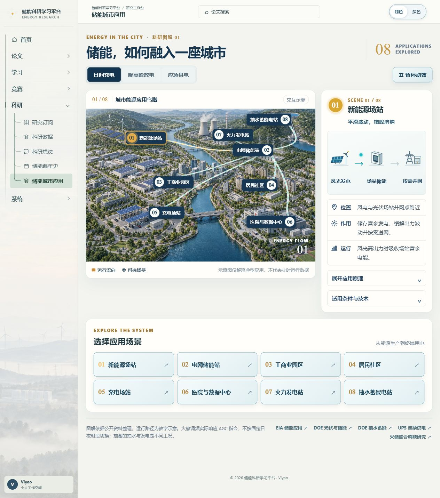
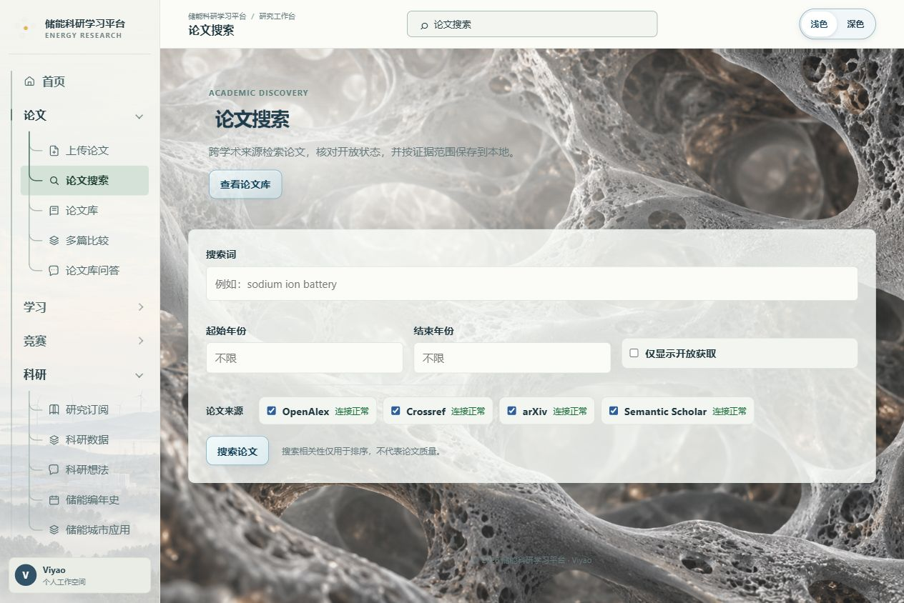
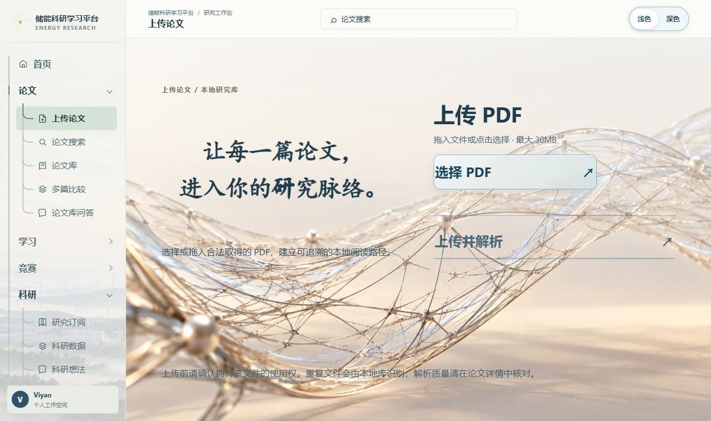

# Energy Research Copilot

**面向大学生的储能科研学习平台**：把论文阅读、文献整理、证据核查、学习复习、竞赛准备和储能研究资料放在一个可本地运行的工作台中。项目由 Viyao 主导产品设计与迭代，AI 工具参与开发。

> 当前版本是响应式 Web 应用，可在手机浏览器访问；原生 iOS/Android 应用尚未提供。默认单机、本地数据模式，适合个人学习与科研原型使用。

## 解决的问题

大学生做科研时，常要在 PDF 阅读器、文献表格、笔记、课程资料、实验数据、竞赛通知和校园网站之间来回切换。英文论文读得慢、结论难以追溯到原文、复习容易中断、数据条件容易遗漏，刚入门时也难以判断一个想法能否验证。本项目将这些步骤串成可查看、可编辑、可复核的工作流：用自己的论文建立资料库，以页码和原文片段核对回答，整理学习卡片和复习计划，再把论文证据带入科研数据与实验设计。

## 功能

| 学习与科研环节 | 当前提供的功能 |
|---|---|
| 论文发现与整理 | OpenAlex、Crossref、arXiv 文献搜索；PDF 导入与解析；论文库分栏、收藏、已读状态、自动封面图与检索；来源状态区分全文、摘要和元数据 |
| 阅读与证据核查 | 论文快速理解、通俗理解、审稿人速解；图表与术语阅读；按页码、片段和证据状态回查；论文库问答、2–6 篇论文比较 |
| 学习与复习 | 从已读论文创建学习包，生成和编辑知识卡片，进行四类自测，手动确认掌握程度并安排间隔复习 |
| 科研订阅与校园信息 | 研究主题订阅、定时检查、论文推荐、能源科研日报；校园公开资讯整理，含西安交通大学校园资讯入口 |
| 科研数据与想法 | 导入 CSV/XLSX，确认工作表、列、单位和来源后运行固定统计/科研配方；把选定证据带入科研想法、九项实验设计、复核与导出 |
| 储能知识地图 | 储能编年史覆盖 25 条技术路线，按历史、材料、论文、企业、政策市场、储能适配六栏目阅读；储能城市应用用教学示意图解释八类典型城市能源场景，含三种工况 |
| 竞赛与系统 | 科研创新竞赛资料；模型与连接设置、诊断、帮助、备份与恢复 |

论文库封面会从用户导入 PDF 的前 8 页中挑选合适图片；没有合适图片时使用平台主题插画。公开版包含平台界面和研究教学所需素材，不包含维护者的个人论文、数据集、数据库或密钥。新下载者得到空白个人资料库，可自行导入文件。论文阅读、证据到学习与科研数据的操作流程见[功能流程说明](docs/github/WORKFLOWS.md)。

模型供应商目录目前包含 18 项选项。初次启动默认使用 Mock 演示模式，不需要 API 密钥；连接真实模型、语义检索或运行部分 OCR 功能时，需按个人选择配置服务或安装本地模型。不同供应商、校园网页和论文来源的可用性会随网络与上游服务变化。

## 界面

| 首页浅色 | 首页深色 |
|---|---|
|  |  |

| 储能编年史 | 储能城市应用 |
|---|---|
|  |  |

| 论文搜索 | 上传论文 |
|---|---|
|  |  |

## 快速启动

需要安装 Docker Desktop（Windows）或 Docker Engine 与 Docker Compose（Linux）。首次启动会构建前后端镜像并下载依赖，CPU 文档处理依赖较大，首次构建需要较多时间与磁盘空间；模型权重不随仓库或镜像复制。之后重新运行启动器即可。

### Windows

在项目根目录 PowerShell 运行：

```powershell
Copy-Item .env.example .env
powershell.exe -NoProfile -ExecutionPolicy Bypass -File .\start.ps1 -Rebuild
```

### Linux

```bash
cp .env.example .env
docker compose up -d --build
```

Windows 启动器会打印实际网页地址（默认从 `http://localhost:3000` 开始寻找空闲端口）；Linux 默认网页地址为 `http://localhost:3000`。后端健康检查地址为后端主机的 `/health`。详细配置见[安装、配置与运行方式](docs/github/SETUP.md)。

项目默认 Mock 模式可以浏览功能并完成演示工作流。使用真实 AI 前，在应用“系统设置”中配置模型；不要把密钥提交到仓库。论文、上传文件和数据库保存在本地 Docker 数据卷，公开代码不包含维护者的个人资料。

## 模型与文档处理

- **文本模型**：可在系统设置选择供应商目录中的模型或填写兼容接口。Ollama 可作为本地模型服务。
- **语义检索**：个人论文库向量使用本地 Ollama `bge-m3`；这是可选服务，Mock 基础演示不需要它。
- **OCR 与版面分析**：本地模型首次使用时由用户在设置中确认下载。Docling 是可选解析器；PDF 页面视觉增强需单独配置并由用户明确触发。
- **隐私边界**：API 密钥保存在后端配置，不发送到浏览器。用户论文和个人数据保存在本机。云端模型功能按界面说明发送明确选择的输入；校园资讯仅整理可公开访问的页面，不绕过登录或访问控制。

## 技术结构

- `frontend/`：Next.js、React、TypeScript Web 应用。
- `backend/`：FastAPI API、论文/学习/研究服务与 Alembic 数据库迁移。
- `docker-compose.yml`：本地前后端编排，默认 SQLite 与本地文件存储。
- `docs/`：架构、帮助、安装及研究/素材来源说明。

下载后即可用 Compose 构建前后端。用户资料库存放在 Docker 持久卷，与仓库代码及公共界面素材分开。项目当前按单机个人使用设计；若部署成多人共用的公网网站，需要先加入账户认证、用户隔离和适合线上环境的存储配置。移动端目前通过响应式网页提供访问。

## 许可与素材

代码使用 MIT License。MIT 仅适用于项目代码，不自动涵盖摄影、字体、图标、模型或其他第三方素材。素材来源与许可记录见 [公开版素材说明](docs/github/ASSETS.md) 及各素材旁的来源清单；保留署名、链接和适用条件。使用者应按素材自身许可使用。

## 文档

- [安装、配置与运行方式](docs/github/SETUP.md)
- [本地开发与云端协作](docs/github/SETUP.md#本地开发)
- [从论文到学习与研究的流程](docs/github/WORKFLOWS.md)
- [公开版素材与许可说明](docs/github/ASSETS.md)
- [Architecture](ARCHITECTURE.md) · [API Design](API_DESIGN.md) · [Privacy](PRIVACY.md)
